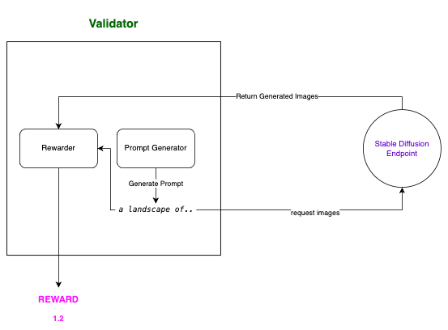

# Text to Image Rewarding using Mixture of Experts
1. Implementing a simple but efficient module for Evaluating Text To Image (T2I) Model
2. Validate performance of this Rewarding Module by mimicking the process in production


**Rewarding Module**

To rewarding a pair of prompt-images, we accumulate score from many SOTA in Text To Image Assessment:
- ImageReward: Learning and Evaluating Human Preferences for Text-to-Image Generation
[code](https://github.com/THUDM/ImageReward) [paper](https://arxiv.org/abs/2304.05977)

<!-- - Human Preference Score v2: A Solid Benchmark for Evaluating Human Preferences of Text-to-Image Synthesis [code](https://github.com/tgxs002/HPSv2) [paper](https://arxiv.org/abs/2306.09341)
- Pick-a-pic score [code](https://huggingface.co/yuvalkirstain/PickScore_v1) -->

- Image Aesthetic Score [code](https://github.com/christophschuhmann/improved-aesthetic-predictor)


**Prompter Module**

Provided topics, such as `artiristic style, animated style`, we use embedding retrieval to find `top k` similar prompts from high quality, curated prompt database [THUDM/ImageRewardDB](https://huggingface.co/datasets/THUDM/ImageRewardDB)

**Implementation** https://github.com/toilaluan/ig-rewarding

## Getting Started
1. Install requirements: `pip install -r requirements.txt`
2. Update `transformers`, `datasets`, `accelerate` to the lastest version: `pip install -U transformers datasets accelerate`

## Mimic validating process
1. Init the validator
```python
from ig_rewarding import Validator
import yaml
config_file = "ig_rewarding/config/baseline.yaml"
with open(config_file, "r") as f:
    config = yaml.load(f, Loader=yaml.FullLoader)
validator = Validator(config["rewarder"], config["prompter"])
```
2. Use `validator.prompter` to generate prompts based on topics
```python
# Generate random prompt based on topic using Validator.prompter

topics = ["a image of landscape, detail, realistic, beautiful", "a image of anime character, realistic, ultra hd"]
prompts = validator.generate_prompt(topics, n_prompts=2)
for topic, prompt_set in zip(topics, prompts):
  print('-'*10)
  print(topic)
  print(prompt_set)
```
```console
----------
a image of landscape, detail, realistic, beautiful
['an amazing landscape image, breathtaking', 'handmade stunning landscape of a big and deep forest, ornate, beautiful, atmosphere, vibe, mist, chimney, pristine, puddles, melting, dripping, creek, lush, forest, roses, flowers, by kilian eng jake parker loish, octane render, 8 k hd resolution, high quality image ']
----------
a image of anime character, realistic, ultra hd
['painting of anime girl,, ultra realistic, sharp details, subsurface scattering, intricate details, warm lighting, beautiful features, highly detailed, photorealistic, octane render, 8 k, unreal engine, art by artgerm and greg rutkowski and alphonse mucha ', '”ultra realistic, Half-body-Portrait of a beautiful Female anime character, modern, cyberpunk intricate, elegant, super highly detailed, professional digital painting, artstation, concept art, smooth, sharp focus, no blur, no dof, extreme illustration, Unreal Engine 5, Photorealism, HD quality, 8k resolution, cinema 4d, 3D, beautiful, cinematic, art by artgerm and greg rutkowski and alphonse mucha and eiichiro oda”']
```
3. Init a SD Pipeline as a miner
```python
from diffusers import StableDiffusionPipeline
import torch

pipe = StableDiffusionPipeline.from_pretrained("OFA-Sys/small-stable-diffusion-v0", torch_dtype=torch.float16)
pipe.to("cuda")
pipe.enable_sequential_cpu_offload()
# Generate 4 images of landscape style using T2I model
images = []
for i in range(4):
  image = pipe(prompts[0][0], num_images_per_prompt=1).images[0]
  images.append(image)
```


4. Compute the reward for this images-prompt
```python
# Get the rewards of this pair of prompt-images
mean_reward, component_rewards = validator.get_reward_score(images, prompts[0][0])
print(mean_reward)
component_rewards
```
```console
1.002005696296692
{'clip_aesthetic_rewarder': 6.349100112915039,
 'image_rewarder': 0.9385147094726562}
```
